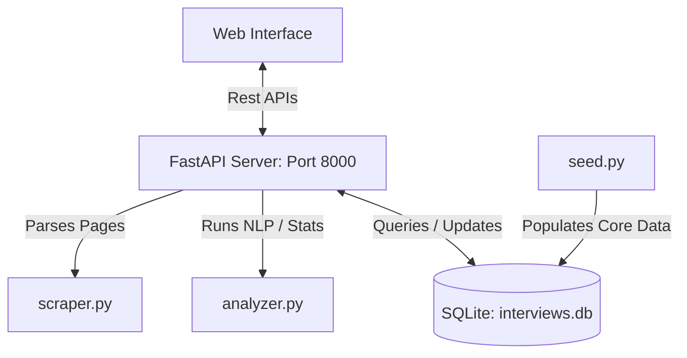

# PrepAI 🚀
### *Interview Question Pattern Analyzer*

PrepAI is an intelligent platform that collects, structures, and analyzes technical and behavioral interview questions from top tech companies. It uses a custom **TF-IDF (Term Frequency-Inverse Document Frequency) keyword extraction model** and frequency analysis to predict high-yield study topics for specific roles, helping students prepare smarter.

---

## Key Features

- 📊 **Interactive Analytics Dashboard**: High-level metrics showing total tracked questions, companies, and roles. Displays responsive, custom SVG charts for category weights, difficulty distribution, and activity ranking.
- 🧠 **Pattern Predictor Engine**: Select a company (e.g., Google, Meta) and a target role (e.g., Software Engineer, Frontend Developer) to generate an AI-like Study Guide containing:
  - Topic weights based on historical focus.
  - Key NLP phrases processed using term-document frequencies.
  - Actionable study advice.
  - Curated high-yield practice questions.
- 🔍 **Question Explorer**: Filter, search, and page through a structured database of questions. Click to view detailed prompts, frequency reports, and difficulty ratings in a custom glassmorphic modal.
- 🕸️ **URL Web Scraper**: Input blog posts, interview experience URLs, or raw text blocks. The backend parser extracts potential questions dynamically, auto-classifies them, and saves them to the SQLite database.
- ✍️ **Custom Submissions Portal**: Log newly encountered questions directly into the system to dynamically update statistics.

---

## System Architecture



---

## Tech Stack

- **Frontend**: React (Vite SPA) styled with modern glassmorphic Vanilla CSS (responsive, dark-mode, custom animations).
- **Backend**: FastAPI (Python 3.10+) serving lightweight asynchronous API endpoints.
- **Database**: SQLite (SQLAlchemy / sqlite3) for zero-config local storage.
- **Natural Language Processing**: Native Python TF-IDF tokenizer and document indexer.

---

## Local Setup Instructions

### 1. Prerequisites
- **Python 3.10+**
- **Node.js 18+**

### 2. Backend Setup
1. Navigate to the backend folder:
   ```bash
   cd backend
   ```
2. Install Python dependencies:
   ```bash
   pip install beautifulsoup4 fastapi uvicorn requests
   ```
3. Initialize and seed the SQLite database with 45+ top interview questions:
   ```bash
   python seed.py
   ```
4. Run the FastAPI development server:
   ```bash
   python -m uvicorn main:app --port 8000 --reload
   ```
   The backend will be running at [http://127.0.0.1:8000](http://127.0.0.1:8000). You can explore Swagger API documentation at `http://127.0.0.1:8000/docs`.

### 3. Frontend Setup
1. Navigate to the frontend folder:
   ```bash
   cd ../frontend
   ```
2. Install Node packages:
   ```bash
   npm install
   ```
3. Launch the Vite development server:
   ```bash
   npm run dev
   ```
   The frontend will be running at [http://localhost:5173/](http://localhost:5173/).

---

## Project Structure

```
├── backend/
│   ├── main.py            # FastAPI main app
│   ├── analyzer.py        # Custom TF-IDF & stats engine
│   ├── db.py              # SQLite database initializers
│   ├── scraper.py         # BeautifulSoup HTML scraper
│   ├── seed.py            # Pre-seeded interview questions
│   ├── test_backend.py    # Backend pipeline verification tests
│   └── interviews.db      # SQLite database file
├── frontend/
│   ├── src/
│   │   ├── App.jsx        # Main React dashboard layout
│   │   ├── index.css      # Core dark-mode glassmorphic styling
│   │   └── main.jsx       # Mount entry point
│   ├── index.html         # Main template html
│   └── package.json       # React dependencies
└── .gitignore             # Root gitignore rules
```
